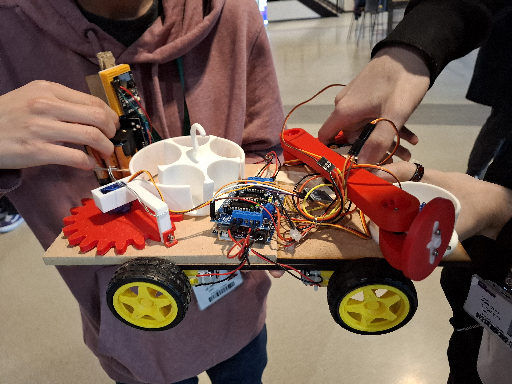
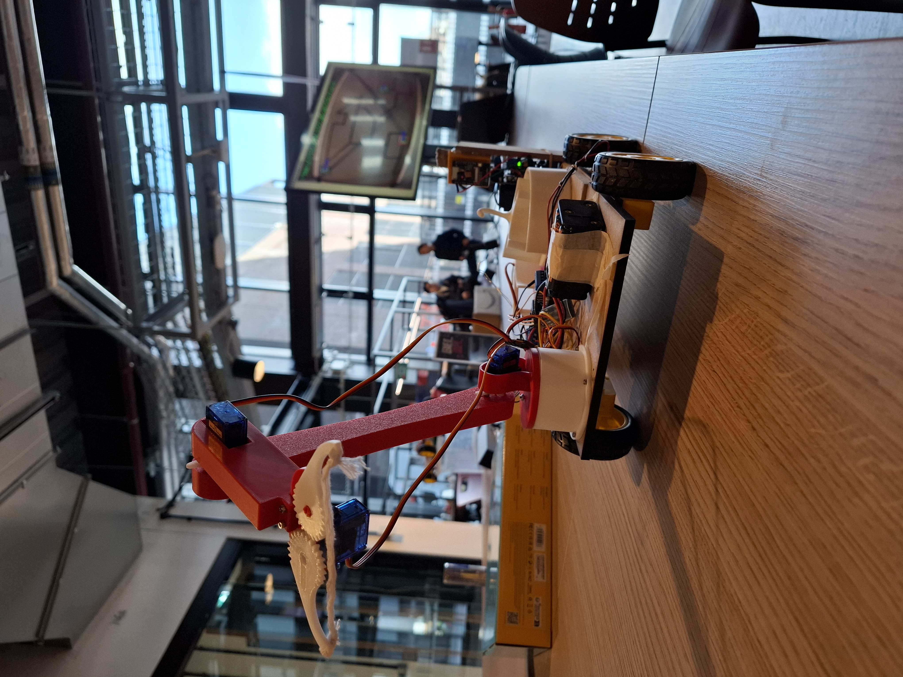

### [Here](https://cad.onshape.com/documents/a268ab2498fb3e9be9acaab0/w/7d4ee1e296fe707dd0418768/e/6b86635f86ffe581ea81f46a?renderMode=0&uiState=6809309994d83e4a5b5c4541) you can view the CAD of the arm and barrel storage mechanism
### Some pictures from the event:

